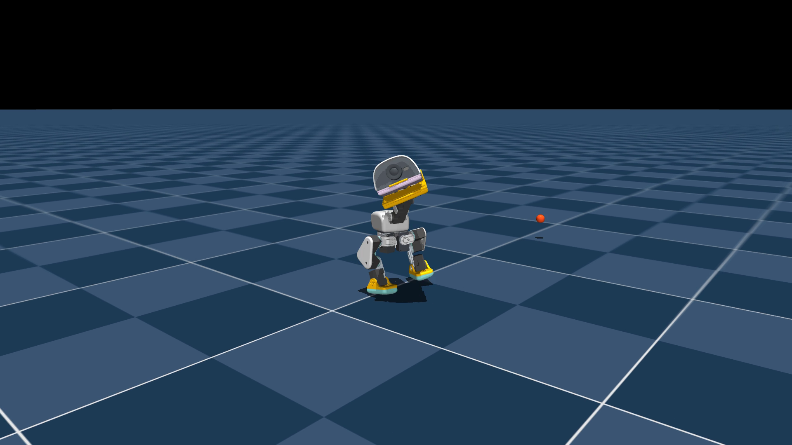

# Microduck Beak Throw

An experimental reinforcement-learning policy that makes a Microduck wind up,
throw a 24 mm ball from its beak, and recover to standing.

> **Status: simulation-validated, hardware-unvalidated.** The selected policy
> passed 50/50 randomized simulator trials only with the mandatory anatomical
> target clamp. It failed the strict raw-output safety gate. Read
> [SAFETY.md](SAFETY.md) before considering a supervised hardware test.

[](media/preview_model_2150.mp4)

Click the image for the exact selected policy in MuJoCo.

- **Download the weights and model card:**
  [Hugging Face — q2p/microduck-beak-throw](https://huggingface.co/q2p/microduck-beak-throw)
- **Download the complete tester bundle:**
  [GitHub release v0.1.0-sim](https://github.com/llama/microduck-beak-throw/releases/tag/v0.1.0-sim)
- **Upstream projects:**
  [microduck_rl](https://github.com/pollen-robotics/microduck_rl) and
  [Microduck runtime](https://github.com/pollen-robotics/microduck)

## What it does

The 61-observation / 14-action policy drives the legs and head at 50 Hz. The
mouth is not a fifteenth learned action: the runtime holds it at +20 degrees,
opens it to +30 degrees over phase 0.30–0.34 of the 2.4-second motion, and then
switches to the packaged standing policy. A shallow compliant liner supplies
the lip, rear stop, and side cheeks needed to retain a sphere during wind-up.

In 50 deterministic-seed randomized simulator episodes, the exact packaged
ONNX achieved 50 valid releases, landings, carry/lateral passes, and upright
recoveries. Median forward carry was 0.525 m; median lateral carry was -0.113 m;
median final tilt after the stand phase was 0.376 degrees. Its median raw target
limit excess was 0.751 rad, so the runtime clamp is required and this is not a
production-accepted policy. Full results are in [docs/ACCEPTANCE.txt](docs/ACCEPTANCE.txt).

## Repository map

- `training/`: a reproducible patch and overlay for the exact upstream
  `microduck_rl` base used for the experiments.
- `runtime/`: the Microduck runtime patch and opt-in configuration.
- `hardware/`: the supervised test protocol and editable reference liner.
- `docs/`: provenance, evaluation, and software-validation reports.
- `media/`: preview of checkpoint `model_2150.pt`, the selected policy.

Weights are intentionally hosted on Hugging Face. The GitHub release also
contains a self-contained tester ZIP with both ONNX policies, runtime patch,
liner, checksums, and instructions.

## Reproduce in the simulator

First reconstruct the training checkout by following
[training/README.md](training/README.md). Download `model_2150.pt` from the
Hugging Face repository into that checkout, then on macOS run:

```bash
.venv/bin/mjpython .venv/bin/play Mjlab-BeakThrow-Hardware-MicroDuck \
  --checkpoint-file model_2150.pt --num-envs 1
```

On Linux, use the same `play` command through the project's normal `uv run`
environment rather than `mjpython`.

## Hardware path

The deployable sequence is a hybrid controller: throw policy for 2.4 seconds,
then the supplied standing policy. Start at [hardware/INSTALL_AND_TEST.md](hardware/INSTALL_AND_TEST.md).
The first powered trial must have an empty beak. The reference liner must be
measured and adapted to the actual bill; its mounting face has not been checked
against a physical robot. Never test near people, animals, glass, or electronics.

## Provenance and license

The source overlay is based on `pollen-robotics/microduck_rl` commit
`d424a0c899f6b33cbd3daeb279913134349c0b63`. The runtime patch is based on
`pollen-robotics/microduck` commit
`590b986bd8c0d50ae02cb3ea2f59c463b6828168`.

Code and released model weights are Apache-2.0 licensed. Upstream robot assets
remain subject to their original notices and licenses.
