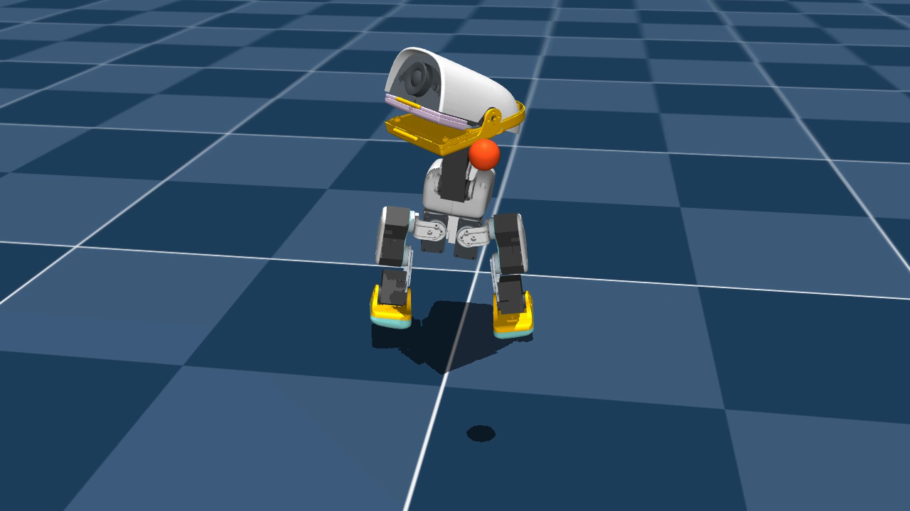

# beak-throw

Wind up, throw a 24 mm ball from the beak, and recover to a two-foot stand.

[](media/preview.mp4)

The linked preview shows three separately reset episodes from the released
checkpoint at half speed with locked cameras: the ball comes toward the lens,
then crosses to the right and left of it.

- **Weights and model card:**
  [q2p/microduck-beak-throw](https://huggingface.co/q2p/microduck-beak-throw)
- **Complete tester bundle:**
  [v0.1.0-sim release](https://github.com/llama/microduck-beak-throw/releases/tag/v0.1.0-sim)

> **Simulation-validated, hardware-unvalidated.** The policy completed 50/50
> randomized simulator trials only with the mandatory runtime anatomical clamp.
> It failed the strict raw-output gate. Read [SAFETY.md](SAFETY.md) before any
> supervised hardware experiment; the first powered run must be empty-beak.

**Command** — one-shot skill: `robotctl robot do beak-throw`. The 14-action
network controls the body and head. The patched runtime holds the mouth at +20°,
opens it to +30° over phase 0.30–0.34 of the 2.4-second motion, then hands off
to the supplied standing policy.

**What it does** — throws a 24 mm / 3 g simulated ball about 0.53 m forward.
The ball is physically retained by compliant pads, a rounded front lip, a rear
stop, and side cheeks rather than by a weld or teleport.

**Limits** — 50/50 randomized trials passed the release, landing, ≥0.50 m
forward, ≤0.20 m lateral, and hybrid-recovery checks. The raw network exceeded
the strict target limit in 50/50 trials (median 0.751 rad), making the supplied
runtime clamp mandatory. Full results: [docs/ACCEPTANCE.txt](docs/ACCEPTANCE.txt).

## Try it in simulation

```bash
git clone https://github.com/llama/microduck-beak-throw.git
git clone https://github.com/pollen-robotics/microduck_rl.git && cd microduck_rl
git checkout d424a0c899f6b33cbd3daeb279913134349c0b63
git apply ../microduck-beak-throw/training/microduck_rl-shared-files.patch
rsync -a ../microduck-beak-throw/training/overlay/ ./
uv sync
uv run hf download q2p/microduck-beak-throw checkpoints/model_2150.pt --local-dir policies/beak-throw
```

Linux:

```bash
uv run play Mjlab-BeakThrow-Hardware-MicroDuck \
  --checkpoint-file policies/beak-throw/checkpoints/model_2150.pt --num-envs 1
```

macOS:

```bash
ln -sf "$(.venv/bin/python -c 'import sys; print(sys.base_prefix)')/lib/libpython3.12.dylib" .venv/libpython3.12.dylib
.venv/bin/mjpython .venv/bin/play Mjlab-BeakThrow-Hardware-MicroDuck \
  --checkpoint-file policies/beak-throw/checkpoints/model_2150.pt --num-envs 1
```

## Try it on the robot

This requires the included runtime patch; it is not a simple policy swap.

```bash
git clone https://github.com/pollen-robotics/microduck.git && cd microduck
git checkout 590b986bd8c0d50ae02cb3ea2f59c463b6828168
hf download q2p/microduck-beak-throw beak_throw.onnx alpha_stand.onnx runtime/microduck-runtime.patch --local-dir beak-throw
git apply beak-throw/runtime/microduck-runtime.patch
cp beak-throw/beak_throw.onnx policies/beak_throw.onnx
cp beak-throw/alpha_stand.onnx policies/alpha_stand.onnx
scripts/dev-push.sh --docker radxa@<robot>
```

Then add the values in [runtime/robotd-beak-throw.toml](runtime/robotd-beak-throw.toml)
to the robot's existing `[policy]` section, restart `robotd`, and follow
[hardware/INSTALL_AND_TEST.md](hardware/INSTALL_AND_TEST.md). Measure and adapt
the reference liner before any loaded test.

```bash
robotctl health
robotctl monitor
robotctl robot enable
robotctl robot do beak-throw     # EMPTY BEAK FIRST
```

## Repository map

- `training/`: reproducible patch and overlay for the exact `microduck_rl` base.
- `runtime/`: mandatory Microduck runtime patch and opt-in configuration.
- `hardware/`: supervised test protocol and editable compliant liner.
- `docs/`: provenance, acceptance, and software-validation reports.
- `media/preview.mp4`: three half-speed locked views—toward, right, and left.

**Contract** `obs[1,61] f32 → actions[1,14] f32`, normalizer baked in, 50 Hz,
kind episodic, duration 2.4 s, entry pose standing.

**Provenance** source base `pollen-robotics/microduck_rl@d424a0c`; runtime base
`pollen-robotics/microduck@590b986`; selected checkpoint `model_2150.pt`.

Apache-2.0. Upstream robot assets retain their original notices and licenses.
